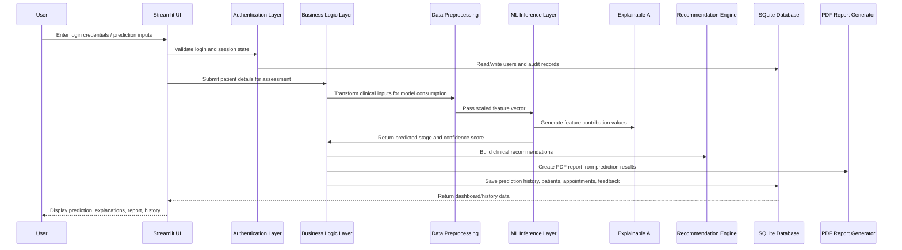
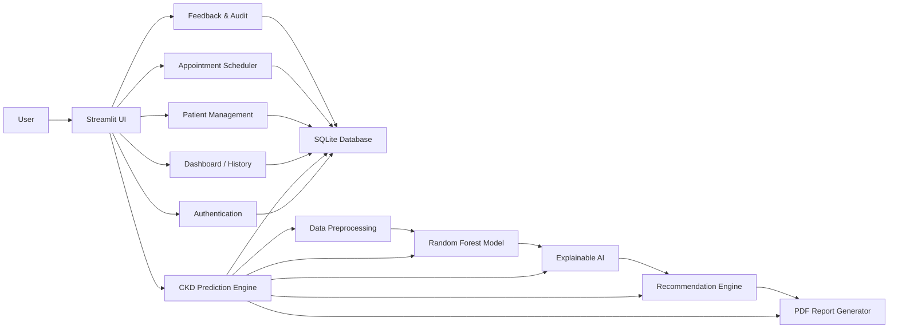

# Software Architecture Diagram and Module Analysis

## 1. Project Overview
This repository implements a Streamlit-based Clinical Decision Support System (CDSS) for Chronic Kidney Disease (CKD) risk prediction. The application combines a web-based user interface, authentication, clinical patient management, machine learning inference, explainable AI, recommendation generation, PDF reporting, and SQLite persistence.

The architecture is organized into layered responsibilities so that user interaction, business operations, predictive analytics, and data storage remain modular and easy to extend.

---

## 2. Layered Architecture (Mermaid)

```mermaid
flowchart TD
    U[User / Clinician / Patient] --> UI[Streamlit UI Layer]
    UI --> AUTH[Authentication Layer]
    AUTH --> BL[Business Logic Layer]
    BL --> ML[Machine Learning Layer]
    ML --> DB[Database Layer]
    DB --> UTIL[Utilities Layer]

    UI --> LOGIN[Login Authentication]
    UI --> DASH[Dashboard]
    UI --> PRED[CKD Prediction]
    UI --> PAT[Patient Management]
    UI --> APP[Appointment Scheduling]
    UI --> FEED[Feedback Module]
    UI --> AUDIT[Audit Logs]
    UI --> CHAT[CKD Knowledge Base Chatbot<br/>(planned/extension)]

    BL --> HIST[Prediction History]
    BL --> REC[Recommendation Engine]
    BL --> REPORT[PDF Report Generation]

    ML --> PRE[Data Preprocessing]
    ML --> RF[Random Forest Model]
    ML --> CONF[Confidence Score]
    ML --> XAI[Explainable AI]

    DB --> SQLITE[SQLite Database]
```

---

## 3. End-to-End Data Flow (Mermaid)



---

## 4. Module Responsibility Summary

| Module | Responsibility | Python File / Artifact |
|---|---|---|
| Streamlit UI | Main application shell, page routing, forms, charts, and user experience. | [../app.py](../app.py) |
| Login Authentication | Registers users, authenticates credentials, and manages session state. | [../auth.py](../auth.py) |
| Dashboard | Presents analytics, prediction trends, confidence distribution, and model performance metrics. | [../app.py](../app.py) |
| CKD Prediction | Accepts patient inputs, invokes preprocessing and ML inference, and displays results. | [../app.py](../app.py) |
| Data Preprocessing | Loads, cleans, encodes, scales, and prepares feature vectors for model input. | [../ckd_utils/preprocessing.py](../ckd_utils/preprocessing.py) |
| Random Forest Model | Trains and evaluates classifiers, then persists the best model bundle for prediction. | [../train_model.py](../train_model.py), [../ckd_utils/prediction.py](../ckd_utils/prediction.py) |
| Confidence Score | Computes the probability-based confidence of the predicted CKD stage. | [../app.py](../app.py), [../ckd_utils/prediction.py](../ckd_utils/prediction.py) |
| Explainable AI | Reveals which clinical factors influenced the prediction outcome. | [../ckd_utils/prediction.py](../ckd_utils/prediction.py) |
| Recommendation Engine | Creates tailored dietary, lifestyle, and medical guidance based on the predicted stage. | [../ckd_utils/report_generator.py](../ckd_utils/report_generator.py) |
| PDF Report Generation | Creates a hospital-style PDF assessment report and optionally emails it. | [../ckd_utils/report_generator.py](../ckd_utils/report_generator.py), [../app.py](../app.py) |
| Prediction History | Stores prediction records and allows retrieval, filtering, and export. | [../auth.py](../auth.py), [../app.py](../app.py) |
| Patient Management | Supports creating, reading, updating, and deleting patient profiles. | [../auth.py](../auth.py), [../app.py](../app.py) |
| Appointment Scheduling | Manages follow-up appointments and reminder records. | [../auth.py](../auth.py), [../app.py](../app.py) |
| Feedback Module | Collects user rating and comment feedback associated with predictions. | [../auth.py](../auth.py), [../app.py](../app.py) |
| Audit Logs | Records authentication, prediction, patient, and administrative actions for review. | [../auth.py](../auth.py), [../app.py](../app.py) |
| CKD Knowledge Base Chatbot | Not implemented as a dedicated module in the current repository; represented as a future extension for CKD education and guidance. | No dedicated Python file in the current codebase; closest UI exposure is the About/educational content in [../app.py](../app.py) |
| SQLite Database | Persists users, predictions, patients, appointments, feedback, and audit logs. | [../users.db](../users.db), [../auth.py](../auth.py) |

---

## 5. Detailed Module Analysis

### 5.1 Presentation Layer
- Streamlit UI: The top-level interface that renders the login page, prediction form, dashboard, admin panel, patient management, appointment scheduler, and history pages. Implemented in [../app.py](../app.py).
- Login Authentication: Handles registration, login, logout, password hashing, and email validation using SQLite-backed user records. Implemented in [../auth.py](../auth.py).

### 5.2 Business Logic Layer
- Patient Management: Creates and updates clinical patient profiles that can be reused for future predictions. Implemented in [../auth.py](../auth.py) with UI integration in [../app.py](../app.py).
- Appointment Scheduling: Schedules follow-up reminders for patients and stores them as structured records. Implemented in [../auth.py](../auth.py).
- Feedback Module: Captures qualitative evaluation from clinicians or patients after a prediction. Stored in the feedback table and shown in the admin panel. Implemented in [../auth.py](../auth.py).
- Audit Logs: Records important system events such as login attempts, patient creation, prediction generation, and appointment scheduling. Implemented in [../auth.py](../auth.py).

### 5.3 Machine Learning Layer
- Data Preprocessing: Converts raw clinical data into the format expected by the classifier. It loads datasets, handles missing values, encodes categorical values, and standardizes input features. Implemented in [../ckd_utils/preprocessing.py](../ckd_utils/preprocessing.py).
- Random Forest Model: The project trains multiple classifiers and retains the best-performing model bundle, which may include Random Forest depending on evaluation metrics. Implemented in [../train_model.py](../train_model.py).
- Confidence Score: Uses model probability output to present a confidence percentage for the predicted CKD stage. Computed in [../app.py](../app.py) using values returned by [../ckd_utils/prediction.py](../ckd_utils/prediction.py).
- Explainable AI: Perturbs each input feature and measures its effect on the predicted class probability, enabling transparent reasoning behind predictions. Implemented in [../ckd_utils/prediction.py](../ckd_utils/prediction.py).

### 5.4 Data and Persistence Layer
- SQLite Database: Stores user credentials, prediction history, patient records, appointments, feedback, and audit logs. The database file is [../users.db](../users.db), and the schema is created in [../auth.py](../auth.py).
- Prediction History: Retrieves and displays prior predictions for each user, with search, date filtering, and export capabilities. Implemented in [../auth.py](../auth.py) and [../app.py](../app.py).

### 5.5 Utility and Reporting Layer
- Recommendation Engine: Produces tailored health recommendations based on the predicted stage and patient factors. Implemented in [../ckd_utils/report_generator.py](../ckd_utils/report_generator.py).
- PDF Report Generation: Builds a professional report in PDF format for clinical or patient sharing. Implemented in [../ckd_utils/report_generator.py](../ckd_utils/report_generator.py) and invoked from [../app.py](../app.py).
- Assets and Model Artifacts: The system stores evaluation visuals and model artifacts in [../assets](../assets) and [../model](../model). These support dashboard understanding and inference.

---

## 6. Presentation-Friendly Block Diagram



---

## 7. Database Schema Summary
The SQLite database contains the following tables:
- users: stores account credentials and email information.
- predictions_v2: stores prediction outcomes, confidence scores, timestamps, and feature values.
- patients: stores reusable patient clinical profiles.
- appointments: stores scheduled follow-up appointments.
- feedback: stores user feedback and ratings.
- audit_logs: stores system activity logs.

---

## 8. Architectural Interpretation for Final Year Project Report
The project follows a layered, modular architecture aligned with modern software engineering principles:
1. Separation of concerns between UI, validation, business logic, ML inference, and persistence.
2. Clear data flow from user entry through preprocessing and prediction to reporting and storage.
3. Extensibility for adding improved models, deeper explainability, and conversational chatbot modules in the future.
4. Practical deployment readiness through a lightweight Streamlit-based interface and SQLite backend.

This design is suitable for a final-year engineering demonstration because it combines software engineering, machine learning, clinical decision support, and report generation in a single cohesive system.
